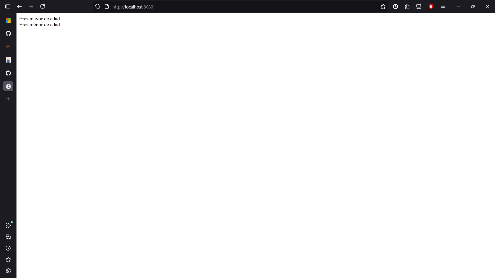
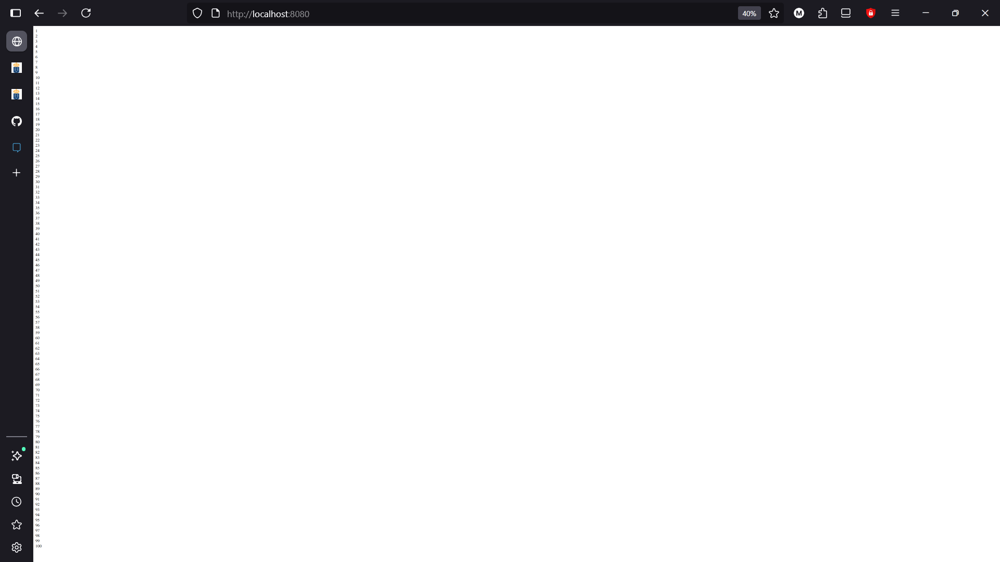
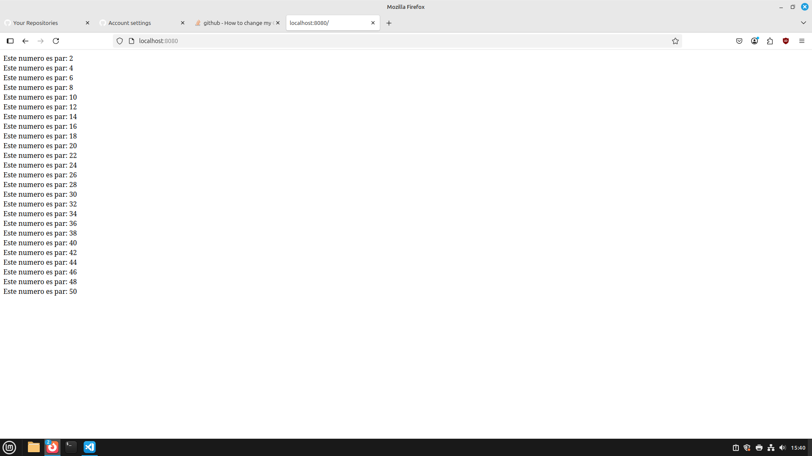

# Introduccion_PHP


## Indice
|Ejercicios |Realizados|Dificultad|
|----------|------------|----------|
|[Ejercicio 1](#ejercicio-1)|✔️|1|
[Ejercicio 2](#ejercicio-2)|✔️|1|
[Ejercicio 3](#ejercicio-3)|✔️|1|
|[Ejercicio 4](#ejercicio-4)|✔️|1|
|[Ejercicio 5](#ejercicio-5)|✔️|1|
|[Ejercicio 6](#ejercicio-6)|✔️|1|
|[Ejercicio 7](#ejercicio-7)|✔️|1|
|[Ejercicio 8](#ejercicio-8)|✔️|1|
|[Ejercicio 9](#ejercicio-9)|✔️|1|
|[Ejercicio 10](#ejercicio-10)|❌|0|
|[Ejercicio 11](#ejercicio-11)|❌|0|
|[Ejercicio 12](#ejercicio-12)|❌|0|
|[Ejercicio 13](#ejercicio-13)|❌|0|
|[Ejercicio 14](#ejercicio-14)|❌|0|
|[Ejercicio 15](#ejercicio-15)|❌|0|
|[Ejercicio 16](#ejercicio-16)|❌|0|
|[Ejercicio 17](#ejercicio-17)|❌|0|
|[Ejercicio 18](#ejercicio-18)|❌|0|
|[Ejercicio 19](#ejercicio-19)|❌|0|
|[Ejercicio 20](#ejercicio-20)|❌|0|


## [Ejercicio 1](#indice)

Pide dos números y muestra cuál es mayor o si son iguales.

### Codigo:
```
<?php
$numero1=10;
$numero2=8;
if($numero1>$numero2){
    echo "$numero1 es mayor que $numero2"; 
}
if($numero1<$numero2){
    echo "$numero2 es mayor que $numero1"; 
}
?>
```
### Resultado:


## [Ejercicio 2](#indice)

Pide la edad de una persona y muestra:

    "Eres menor de edad" si es < 18.
    "Eres mayor de edad" si es ≥ 18.


### Codigo:

```
<?php
$edad=19;
if($edad>=18){
    echo "Eres mayor de edad"; 
}
echo "<br>";
$edad=17;
if($edad<18){
    echo "Eres menor de edad"; 
}
?>
```
### Resultado:



## [Ejercicio 3](#indice)

Positivo, negativo o cero
<br/>
Comprueba si un número almacenado en una variable es positivo, negativo o cero.

### Codigo:
```
<?php
$numero=5;
if($numero>=1){
    echo "Es un numero positivo"; 
}
echo "<br>";
$numero=-1;
if($numero<0){
   echo "Es un numero negativo"; 
}
echo "<br>";
$numero=0;
if($numero==0){
   echo "Es cero"; 
}
?>
```
### Resultado:


## [Ejercicio 4](#indice)


Nota final

Pide la nota de un alumno y muestra:

    "Suspenso" (< 5), "Aprobado" (5–6), 
    "Notable" (7–8), "Sobresaliente" (9–10).


### Codigo:
```
<?php
$nota=4;
if($nota<5){
    echo "Suspenso"; 
}
echo "<br>";
$nota=5;
if($nota>=5 & $nota<=6){
   echo "Aprobado"; 
}
echo "<br>";
$nota=7;
if($nota>6 & $nota<=8){
   echo "Notable"; 
}
echo "<br>";
$nota=10;
if($nota>8 & $nota<=10){
   echo "Sobresaliente"; 
}
?>
```
### Resultado:


## [Ejercicio 5](#indice)

Contar del 1 al 100

Muestra los números del 1 al 100 en pantalla.


### Codigo:
```
<?php
$numero=1;
while ($numero <= 100) {
    echo $numero . "<br>";
    $numero++;
}
?>

```
### Resultado:



## [Ejercicio 6](#indice)
Suma acumulada

Calcula la suma de los números del 1 al 50 usando un bucle.


### Codigo:
```
<?php
$contador=1;
$numero=0;
while ($contador <= 50) {
    $numero += $contador;
    $contador++;
}
echo "La suma de los números del 1 al 50 es: $numero";
?>
```
### Resultado:


## [Ejercicio 7](#indice)

Tabla de multiplicar

Pide un número y genera su tabla de multiplicar del 1 al 10.


### Codigo:
```
<?php
$multiplo=1;
$multiplicador=1;
while ($multiplo<=10){
    echo "Tabla del $multiplo";
    echo"<br>";
    while($multiplicador<=10){
        $resultado=$multiplicador*$multiplo;
        echo "$multiplo * $multiplicador = $resultado";
        echo"<br>";
        $multiplicador++;
    }
    $multiplicador=1;
    $multiplo++;
}

?>
```
### Resultado:


## [Ejercicio 8](#indice)

Números pares

Muestra todos los números pares entre 1 y 50.


### Codigo:
```
<?php
$numero=1;
while ($numero<=50){
    if($numero%2==0){
        echo "Este numero es par: $numero";
        echo "<br>";
    }
    $numero++;
}
?>
```
### Resultado:



## [Ejercicio 9](#indice)

Cuenta atrás

Haz un bucle que cuente de 10 a 1 y luego muestre 

"¡Fin!".


### Codigo:
```
<?php
$num=10;
while($num>0){
    echo "$num";
    echo "<br>";
    if($num==1){
    echo "¡Fin!";
    }
    $num--;
}
?>

```
### Resultado:


## [Ejercicio 10](#indice)

Nota final

Pide la nota de un alumno y muestra:

    "Suspenso" (< 5), "Aprobado" (5–6), 
    "Notable" (7–8), "Sobresaliente" (9–10).


### Codigo:
```
<?php

$nota=4;

if($nota<5){
    echo "Suspenso"; 
}
echo "<br>";
$nota=5;
if($nota>=5 & $nota<=6){
   echo "Aprobado"; 
}
echo "<br>";
$nota=7;
if($nota>6 & $nota<=8){
   echo "Notable"; 
}
echo "<br>";
$nota=10;
if($nota>8 & $nota<=10){
   echo "Sobresaliente"; 
}
?>
```
### Resultado:


## [Ejercicio 11](#indice)
Nota final

Pide la nota de un alumno y muestra:

    "Suspenso" (< 5), "Aprobado" (5–6), 
    "Notable" (7–8), "Sobresaliente" (9–10).


### Codigo:
```
<?php

$nota=4;

if($nota<5){
    echo "Suspenso"; 
}
echo "<br>";
$nota=5;
if($nota>=5 & $nota<=6){
   echo "Aprobado"; 
}
echo "<br>";
$nota=7;
if($nota>6 & $nota<=8){
   echo "Notable"; 
}
echo "<br>";
$nota=10;
if($nota>8 & $nota<=10){
   echo "Sobresaliente"; 
}
?>
```
### Resultado:


## [Ejercicio 12](#indice)
Nota final

Pide la nota de un alumno y muestra:

    "Suspenso" (< 5), "Aprobado" (5–6), 
    "Notable" (7–8), "Sobresaliente" (9–10).


### Codigo:
```
<?php

$nota=4;

if($nota<5){
    echo "Suspenso"; 
}
echo "<br>";
$nota=5;
if($nota>=5 & $nota<=6){
   echo "Aprobado"; 
}
echo "<br>";
$nota=7;
if($nota>6 & $nota<=8){
   echo "Notable"; 
}
echo "<br>";
$nota=10;
if($nota>8 & $nota<=10){
   echo "Sobresaliente"; 
}
?>
```
### Resultado:


## [Ejercicio 13](#indice)
Nota final

Pide la nota de un alumno y muestra:

    "Suspenso" (< 5), "Aprobado" (5–6), 
    "Notable" (7–8), "Sobresaliente" (9–10).


### Codigo:
```
<?php

$nota=4;

if($nota<5){
    echo "Suspenso"; 
}
echo "<br>";
$nota=5;
if($nota>=5 & $nota<=6){
   echo "Aprobado"; 
}
echo "<br>";
$nota=7;
if($nota>6 & $nota<=8){
   echo "Notable"; 
}
echo "<br>";
$nota=10;
if($nota>8 & $nota<=10){
   echo "Sobresaliente"; 
}
?>
```
### Resultado:


## [Ejercicio 14](#indice)
Nota final

Pide la nota de un alumno y muestra:

    "Suspenso" (< 5), "Aprobado" (5–6), 
    "Notable" (7–8), "Sobresaliente" (9–10).


### Codigo:
```
<?php

$nota=4;

if($nota<5){
    echo "Suspenso"; 
}
echo "<br>";
$nota=5;
if($nota>=5 & $nota<=6){
   echo "Aprobado"; 
}
echo "<br>";
$nota=7;
if($nota>6 & $nota<=8){
   echo "Notable"; 
}
echo "<br>";
$nota=10;
if($nota>8 & $nota<=10){
   echo "Sobresaliente"; 
}
?>
```
### Resultado:


## [Ejercicio 15](#indice)
Nota final

Pide la nota de un alumno y muestra:

    "Suspenso" (< 5), "Aprobado" (5–6), 
    "Notable" (7–8), "Sobresaliente" (9–10).


### Codigo:
```
<?php

$nota=4;

if($nota<5){
    echo "Suspenso"; 
}
echo "<br>";
$nota=5;
if($nota>=5 & $nota<=6){
   echo "Aprobado"; 
}
echo "<br>";
$nota=7;
if($nota>6 & $nota<=8){
   echo "Notable"; 
}
echo "<br>";
$nota=10;
if($nota>8 & $nota<=10){
   echo "Sobresaliente"; 
}
?>
```
### Resultado:


## [Ejercicio 16](#indice)
Nota final

Pide la nota de un alumno y muestra:

    "Suspenso" (< 5), "Aprobado" (5–6), 
    "Notable" (7–8), "Sobresaliente" (9–10).


### Codigo:
```
<?php

$nota=4;

if($nota<5){
    echo "Suspenso"; 
}
echo "<br>";
$nota=5;
if($nota>=5 & $nota<=6){
   echo "Aprobado"; 
}
echo "<br>";
$nota=7;
if($nota>6 & $nota<=8){
   echo "Notable"; 
}
echo "<br>";
$nota=10;
if($nota>8 & $nota<=10){
   echo "Sobresaliente"; 
}
?>
```
### Resultado:


## [Ejercicio 17](#indice)
Nota final

Pide la nota de un alumno y muestra:

    "Suspenso" (< 5), "Aprobado" (5–6), 
    "Notable" (7–8), "Sobresaliente" (9–10).


### Codigo:
```
<?php

$nota=4;

if($nota<5){
    echo "Suspenso"; 
}
echo "<br>";
$nota=5;
if($nota>=5 & $nota<=6){
   echo "Aprobado"; 
}
echo "<br>";
$nota=7;
if($nota>6 & $nota<=8){
   echo "Notable"; 
}
echo "<br>";
$nota=10;
if($nota>8 & $nota<=10){
   echo "Sobresaliente"; 
}
?>
```
### Resultado:


## [Ejercicio 18](#indice)
Nota final

Pide la nota de un alumno y muestra:

    "Suspenso" (< 5), "Aprobado" (5–6), 
    "Notable" (7–8), "Sobresaliente" (9–10).


### Codigo:
```
<?php

$nota=4;

if($nota<5){
    echo "Suspenso"; 
}
echo "<br>";
$nota=5;
if($nota>=5 & $nota<=6){
   echo "Aprobado"; 
}
echo "<br>";
$nota=7;
if($nota>6 & $nota<=8){
   echo "Notable"; 
}
echo "<br>";
$nota=10;
if($nota>8 & $nota<=10){
   echo "Sobresaliente"; 
}
?>
```
### Resultado:


## [Ejercicio 19](#indice)

Nota final

Pide la nota de un alumno y muestra:

    "Suspenso" (< 5), "Aprobado" (5–6), 
    "Notable" (7–8), "Sobresaliente" (9–10).


### Codigo:
```
<?php

$nota=4;

if($nota<5){
    echo "Suspenso"; 
}
echo "<br>";
$nota=5;
if($nota>=5 & $nota<=6){
   echo "Aprobado"; 
}
echo "<br>";
$nota=7;
if($nota>6 & $nota<=8){
   echo "Notable"; 
}
echo "<br>";
$nota=10;
if($nota>8 & $nota<=10){
   echo "Sobresaliente"; 
}
?>
```
### Resultado:


## [Ejercicio 20](#indice)
Nota final

Pide la nota de un alumno y muestra:

    "Suspenso" (< 5), "Aprobado" (5–6), 
    "Notable" (7–8), "Sobresaliente" (9–10).


### Codigo:
```
<?php

$nota=4;

if($nota<5){
    echo "Suspenso"; 
}
echo "<br>";
$nota=5;
if($nota>=5 & $nota<=6){
   echo "Aprobado"; 
}
echo "<br>";
$nota=7;
if($nota>6 & $nota<=8){
   echo "Notable"; 
}
echo "<br>";
$nota=10;
if($nota>8 & $nota<=10){
   echo "Sobresaliente"; 
}
?>
```
### Resultado:

