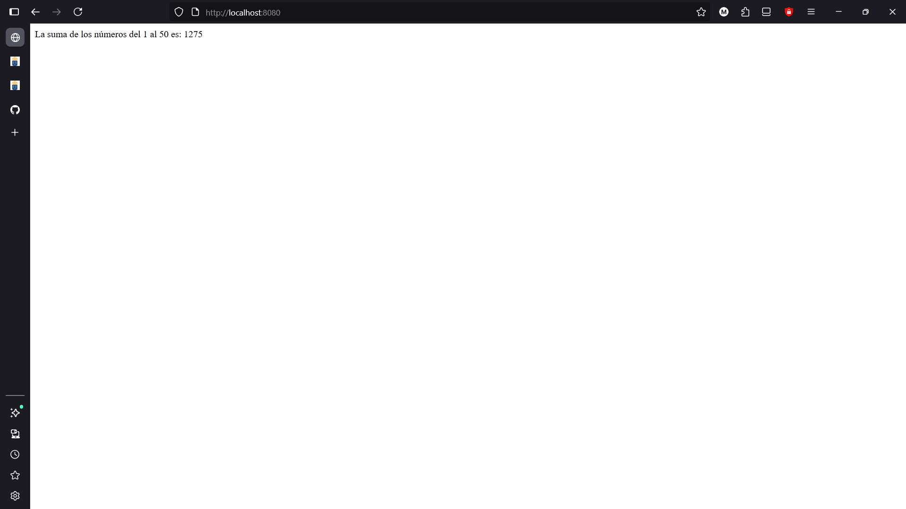
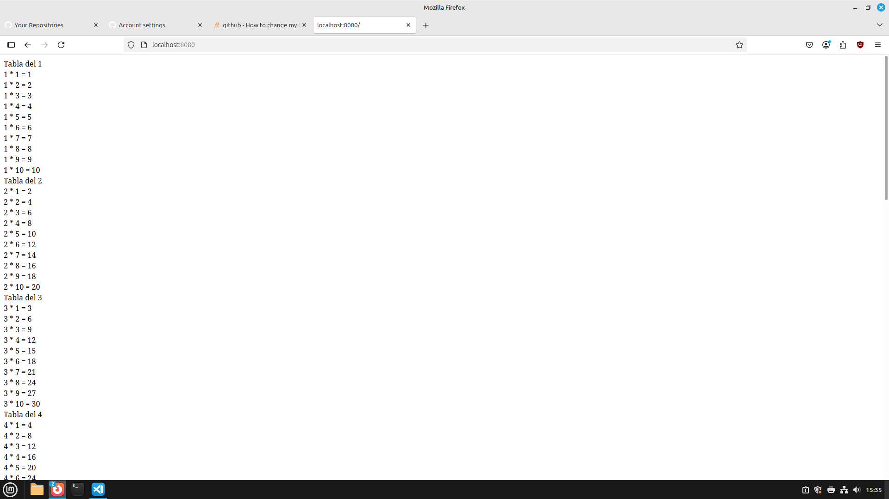
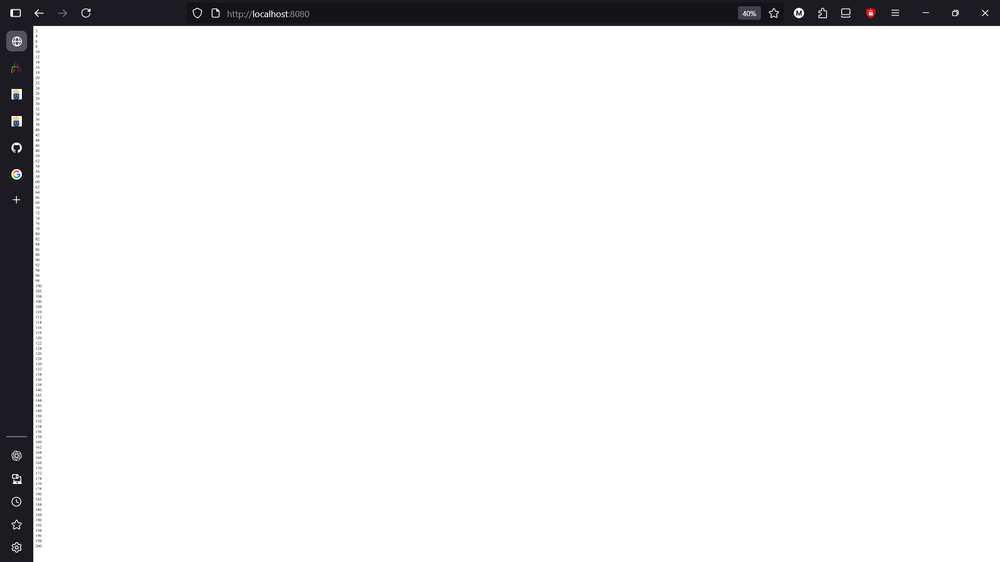

# Introduccion_PHP


## Indice
|Ejercicios |Realizados|Dificultad|
|----------|------------|----------|
|[Ejercicio 1](#ejercicio-1)|✔️|1|
[Ejercicio 2](#ejercicio-2)|✔️|1|
[Ejercicio 3](#ejercicio-3)|✔️|1|
|[Ejercicio 4](#ejercicio-4)|✔️|1|
|[Ejercicio 5](#ejercicio-5)|✔️|1|
|[Ejercicio 6](#ejercicio-6)|✔️|1|
|[Ejercicio 7](#ejercicio-7)|✔️|1|
|[Ejercicio 8](#ejercicio-8)|✔️|1|
|[Ejercicio 9](#ejercicio-9)|✔️|1|
|[Ejercicio 10](#ejercicio-10)|✔️|1|
|[Ejercicio 11](#ejercicio-11)|✔️|2|
|[Ejercicio 12](#ejercicio-12)|✔️|3|
|[Ejercicio 13](#ejercicio-13)|✔️|1|
|[Ejercicio 14](#ejercicio-14)|✔️|1|
|[Ejercicio 15](#ejercicio-15)|✔️|7|
|[Ejercicio 16](#ejercicio-16)|✔️|3|
|[Ejercicio 17](#ejercicio-17)|✔️|4|
|[Ejercicio 18](#ejercicio-18)|✔️|2|
|[Ejercicio 19](#ejercicio-19)|✔️|5|
|[Ejercicio 20](#ejercicio-20)|✔️|2|


## [Ejercicio 1](#indice)

Pide dos números y muestra cuál es mayor o si son iguales.

### Codigo:
```
<?php
$numero1=10;
$numero2=8;
if($numero1>$numero2){
    echo "$numero1 es mayor que $numero2"; 
}
if($numero1<$numero2){
    echo "$numero2 es mayor que $numero1"; 
}
?>
```
### Resultado:


## [Ejercicio 2](#indice)

Pide la edad de una persona y muestra:

    "Eres menor de edad" si es < 18.
    "Eres mayor de edad" si es ≥ 18.


### Codigo:

```
<?php
$edad=19;
if($edad>=18){
    echo "Eres mayor de edad"; 
}
echo "<br>";
$edad=17;
if($edad<18){
    echo "Eres menor de edad"; 
}
?>
```
### Resultado:


## [Ejercicio 3](#indice)

Positivo, negativo o cero
<br/>
Comprueba si un número almacenado en una variable es positivo, negativo o cero.

### Codigo:
```
<?php
$numero=5;
if($numero>=1){
    echo "Es un numero positivo"; 
}
echo "<br>";
$numero=-1;
if($numero<0){
   echo "Es un numero negativo"; 
}
echo "<br>";
$numero=0;
if($numero==0){
   echo "Es cero"; 
}
?>
```
### Resultado:


## [Ejercicio 4](#indice)


Nota final

Pide la nota de un alumno y muestra:

    "Suspenso" (< 5), "Aprobado" (5–6), 
    "Notable" (7–8), "Sobresaliente" (9–10).


### Codigo:
```
<?php
$nota=4;
if($nota<5){
    echo "Suspenso"; 
}
echo "<br>";
$nota=5;
if($nota>=5 & $nota<=6){
   echo "Aprobado"; 
}
echo "<br>";
$nota=7;
if($nota>6 & $nota<=8){
   echo "Notable"; 
}
echo "<br>";
$nota=10;
if($nota>8 & $nota<=10){
   echo "Sobresaliente"; 
}
?>
```
### Resultado:


## [Ejercicio 5](#indice)

Contar del 1 al 100

Muestra los números del 1 al 100 en pantalla.


### Codigo:
```
<?php
$numero=1;
while ($numero <= 100) {
    echo $numero . "<br>";
    $numero++;
}
?>

```
### Resultado:


## [Ejercicio 6](#indice)
Suma acumulada

Calcula la suma de los números del 1 al 50 usando un bucle.


### Codigo:
```
<?php
$contador=1;
$numero=0;
while ($contador <= 50) {
    $numero += $contador;
    $contador++;
}
echo "La suma de los números del 1 al 50 es: $numero";
?>
```
### Resultado:



## [Ejercicio 7](#indice)

Tabla de multiplicar

Pide un número y genera su tabla de multiplicar del 1 al 10.


### Codigo:
```
<?php
$multiplo=1;
$multiplicador=1;
while ($multiplo<=10){
    echo "Tabla del $multiplo";
    echo"<br>";
    while($multiplicador<=10){
        $resultado=$multiplicador*$multiplo;
        echo "$multiplo * $multiplicador = $resultado";
        echo"<br>";
        $multiplicador++;
    }
    $multiplicador=1;
    $multiplo++;
}

?>
```
### Resultado:



## [Ejercicio 8](#indice)

Números pares

Muestra todos los números pares entre 1 y 50.


### Codigo:
```
<?php
$numero=1;
while ($numero<=50){
    if($numero%2==0){
        echo "Este numero es par: $numero";
        echo "<br>";
    }
    $numero++;
}
?>
```
### Resultado:


## [Ejercicio 9](#indice)

Cuenta atrás

Haz un bucle que cuente de 10 a 1 y luego muestre 

"¡Fin!".


### Codigo:
```
<?php
$num=10;
while($num>0){
    echo "$num";
    echo "<br>";
    if($num==1){
    echo "¡Fin!";
    }
    $num--;
}
?>

```
### Resultado:


## [Ejercicio 10](#indice)

Factorial

Calcula el factorial de un número introducido (ejemplo: 5! = 120).


### Codigo:
```
<?php
$numInicio=5;
$resultado=1;
for($i=$numInicio; $i>0;$i--){
    $resultado*=$i;
}
echo "El $numInicio! es $resultado";
?>

```
### Resultado:


## [Ejercicio 11](#indice)

Números primos

Escribe un algoritmo que muestre los números primos entre 1 y 50.


### Codigo:
```
<?php
$numero=1;
$contador=0;
while($numero<=50){
for($i=1; $i<=($numero);$i++){
    if($numero%$i==0){
        $contador++;
    }
}
    if($contador==2){
        echo "El $numero es primo";
        echo "<br>";
    }
$contador=0;
$numero++;
}
?>
```
### Resultado:


## [Ejercicio 12](#indice)

Fibonacci

Genera los primeros 20 términos de la secuencia de Fibonacci.


### Codigo:
```
<?php
$numero1=0;
$numero2=1;
$numerosup=$numero1;
$contador=0;
while($contador<18){
    $resultado=$numero1+$numero2;
    $numero1=$numero2;
    $numero2=$resultado;
    $numerosup=$numero1;
    echo "$resultado<br>";
    $contador++;
}
?>
```
### Resultado:


## [Ejercicio 13](#indice)

Múltiplos de un número

Pide un número n y muestra sus múltiplos hasta 100.


### Codigo:
```
<?php

$numero1 = 2;

for($i = 1; $i <= 100; $i++) {
    $multiplo = $numero1 * $i;
    echo "$multiplo <br>";
}

?>
```
### Resultado:



## [Ejercicio 14](#indice)

Suma de pares e impares

Calcula la suma de los números pares e impares entre 1 y 100 por separado.


### Codigo:
```
<?php
$par=0;
$impar=0;
for ($i=1; $i <=100 ; $i++) { 
    if ($i%2==0) {
        $par+=$i;
    } else {
        $impar+=$i;
    }
}  
echo "La suma de los pares es: $par <br>";
echo "La suma de los impares es: $impar";

?>
```
### Resultado:


## [Ejercicio 15](#indice)

Adivinar número

Genera un número aleatorio entre 1 y 20.
Pide al usuario que lo adivine y usa un bucle con condicionales para dar pistas: "Mayor" o "Menor".


### Codigo:
```
<?php
$numero1=rand(1, 20);
$numero2=rand(1, 20);
$numeroAlmacenado1=1;
$numeroAlmacenado2=20;
while ($numero1!=$numero2) {
    if ($numero1 > $numero2) {
        echo "Mayor <br>";
        $numero2 = rand($numeroAlmacenado1, $numero2);
    }elseif($numero1 < $numero2) {
        echo "Menor <br>";
        $numero2 = rand($numero2, $numeroAlmacenado2);
    }
    $numeroAlmacenado1=$numero2+1;
    $numeroAlmacenado2=$numero2-1;
}
echo "¡Has acertado! El número es $numero1";
?>
```
### Resultado:


## [Ejercicio 16](#indice)

Número perfecto

Comprueba si un número es perfecto (la suma de sus divisores propios es igual al número).

### Codigo:
```
<?php
$numero1 = 33550336;
$resultado = 0;
for($i = 1; $i <= $numero1/2; $i++) {
    if($numero1 % $i == 0) {
        $resultado += $i;
    }
}
if($resultado == $numero1) {
    echo "$numero1 es perfecto";
} else {
    echo "$numero1 no es perfecto";
}
echo "<br>";
$numero1 = 33556;
$resultado = 0;
for($i = 1; $i <= $numero1/2; $i++) {
    if($numero1 % $i == 0) {
        $resultado += $i;
    }
}
if($resultado == $numero1) {
    echo "$numero1 es perfecto";
} else {
    echo "$numero1 no es perfecto";
}
?>
```
### Resultado:


## [Ejercicio 17](#indice)

Invertir número

Escribe un algoritmo que invierta los dígitos de un número
(ejemplo: 123 → 321).


### Codigo:
```
<?php
$int = 43;
echo "Normal: $int <br>";
$numString = (string)$int;
$invertidoString = strrev($numString);
$invertidoInt = (int)$invertidoString;
echo "Invertido: $invertidoInt";
?>
```
### Resultado:


## [Ejercicio 18](#indice)

Palíndromo

Comprueba si una palabra almacenada en una variable es palíndroma.


### Codigo:
```
<?php
$palindromo = "alomomola";
if ($palindromo == strrev($palindromo)) {
    echo "La palabra '$palindromo' es un palíndromo.";
} else {
    echo "La palabra '$palindromo' no es un palíndromo.";
}
?>
```
### Resultado:


## [Ejercicio 19](#indice)

Máximo común divisor (MCD)

Escribe un algoritmo que calcule el MCD de dos números.


### Codigo:
```
<?php
$numero1 = 6;
$numero2 = 9;
if ($numero1 > $numero2) {
    $mayor = $numero1;
    $menor = $numero2;
} else {
    $mayor = $numero2;
    $menor = $numero1;
}
while ($menor != 0) {
    $resto = $mayor % $menor;
    $mayor = $menor;
    $menor = $resto;
}
echo "El MCD de $numero1 y $numero2 es: $mayor";
?>
```
### Resultado:


## [Ejercicio 20](#indice)

Triángulo de asteriscos

Muestra en pantalla un triángulo de altura n usando *.
Ejemplo con n = 5:


### Codigo:
```
<?php
$numero1 = 5;
$numero2=1;
while ($numero2 <=$numero1) {
    for ($i=0; $i < $numero2; $i++) { 
        echo "*";
    }
    echo "<br>";
    $numero2++;
}
?>
```
### Resultado:

