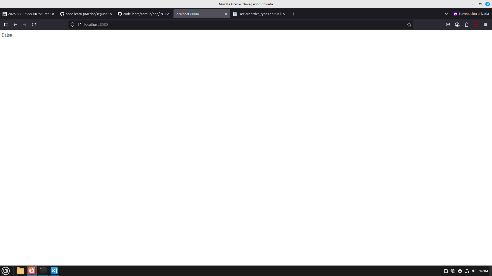
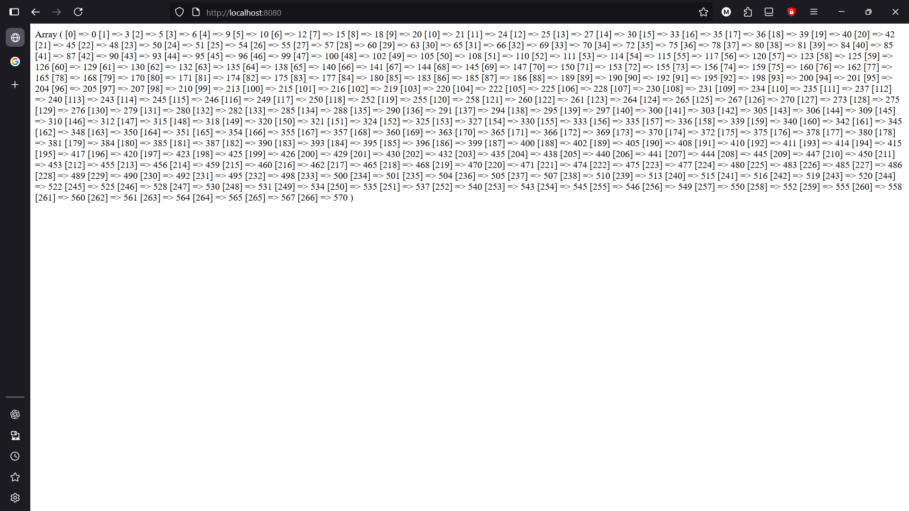
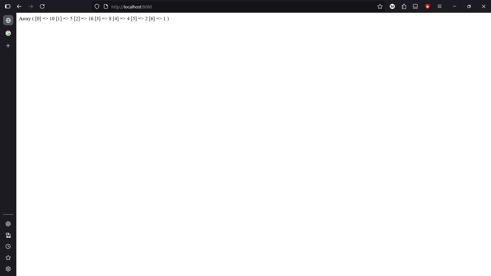

# Introducción a Php, uso de funciones


## Indice
|Ejercicios|Realizados|Dificultad|
|----------|----------|----------|
|[Ejercicio 1](#ejercicio-1)|✔️|1|
|[Ejercicio 2](#ejercicio-2)|❌|10|
|[Ejercicio 3](#ejercicio-3)|✔️|2|
|[Ejercicio 4](#ejercicio-4)|✔️|1|
|[Ejercicio 5](#ejercicio-5)|✔️|1|

## [Ejercicio 1](#indice)

Implementa una función esCapicua(int $n): bool que determine si un número entero positivo es capicúa.

Un número es capicúa si se lee igual de izquierda a derecha que de derecha a izquierda.


### Codigo:

```
<?php
function esCapicua(int $n):bool {
    $num= (int)strrev((String)$n);
    if($n==$num){
        return true;
    }
    return false;
}
if(esCapicua(313)){
    echo "True";
}else{
    echo "False";
}
?>
```

#### Reslutado:



## [Ejercicio 2](#indice)

Implementa una función montañaAsteriscos(int $n, $m): void que imprima una escalera de asteriscos de altura N y el tamaño M.

La primera fila contiene 1 asterisco, la segunda 2, y así hasta N, M veces.

### Codigo:

```
<?php
function montanhaAsteriscos(int $n,int $m):void {
    $arr=[];
    $contador=0;
    $string="";
    while ($contador <$n) {
    for ($i=0; $i < $n; $i++) { 
        if($i==$n/$m){
            array_push($arr,"*");
        }else{
            array_push($arr," ");

        }
    }


    foreach($arr as $posarr){
        $string=strrev((string)$posarr);
        echo $posarr;
        echo $string;
    }
    echo "<br>";
    $contador++;
}
}

montanhaAsteriscos(4,2)
```

#### Reslutado:

## [Ejercicio 3](#indice)

Implementa una función sumaDigitos(int $n): int que calcule la suma de los dígitos de un número entero positivo.

Descompón el número en dígitos y súmalos.

### Codigo:

```
<?php
function sumaDigitos(int $n): int {
    $resultado=0;
    while ($n>0) {
        $resultado+=$n%10;
        $n=(int)($n/10);
    }
    return $resultado;
}

echo sumaDigitos(4726481);

?>
```

#### Reslutado:


## [Ejercicio 4](#indice)

Implementa una función multiplosTresOCinco(int $n): array que devuelva todos los múltiplos de 3 o 5 menores que N.

Además, calcula la suma de dichos múltiplos.


### Codigo:

```
<?php
function multiploTresOCinco(int $n): array {
    $resultado=[];
    for ($i=0; $i<$n; $i++) {
        if ($i%3==0||$i%5==0) {
            $resultado[]=$i;
        }
    }
    return $resultado;
}

print_r(multiploTresOCinco(573));

?>
```

#### Reslutado:




## [Ejercicio 5](#indice)

Implementa una función secuenciaCollatz(int $n): array que genere la secuencia de Collatz a partir de un entero positivo.

Si el número es par → dividir entre 2.

Si es impar → multiplicar por 3 y sumar 1.

Repetir hasta llegar a 1.


### Codigo:

```
<?php
function secuenciaCollatz(int $n): array{
    $resultado=[];
    while ($n!=1) {
        $resultado[]=$n;
        if ($n%2==0) {
            $n=$n/2;
        } else {
            $n=3*$n+1;
        }
    }
    $resultado[] = 1;
    return $resultado;
}
print_r(secuenciaCollatz(10));
?>
```

#### Reslutado:


